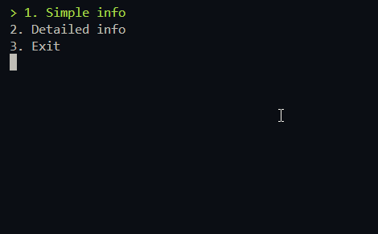

# 🌍 Country Info CLI 🇺🇳

A command-line application that fetches information about countries using the [REST Countries API](https://restcountries.com/), built entirely in **C++** using **libcurl** and **nlohmann::json**.

---

## 📦 Features

- 🔎 Search any country by name
- 🧾 Choose between **Simple** and **Detailed** info:
  - Simple: Name, Capital, Currency, Native name, Population
  - Detailed: Everything above + Region & Timezones
- 🖥️ Interactive menu navigation (arrow keys)
- 🧱 Clean architecture using object-oriented design

---

## ⚙️ Tech Stack

- **C++**
- **libcurl** – for making HTTP requests
- **nlohmann/json** – modern JSON parsing for C++
- **Win32 Console API** – for handling input/output (colors, keys, etc.)

---

## 🧠 Why I Built This

As someone who works mostly with **web development** and **C#**, I wanted to step out of my comfort zone and challenge myself with **native system programming** and **manual memory management**.

> 🔧 This project is a hands-on example of how I'm not afraid to pick up new tools or languages when the job calls for it. Whether it's web, backend, scripting, or low-level — I enjoy learning it all.

This CLI app was both a fun challenge and a valuable experience in:

- Understanding networking at a lower level (no fetch/axios here!)
- Manual error handling (e.g., checking for 404s via HTTP status codes)
- Designing clean, reusable components in C++

---

## 📷 Demo (GIF/Screenshot idea)



---

## 📥 How to Run

> **Note**: This is Windows-specific due to the use of `<windows.h>` and `_getch()`.

### ✅ Prerequisites
- C++17 compatible compiler (e.g., MSVC, g++)
- [libcurl](https://curl.se/libcurl/)
- nlohmann/json (you can just include the `json.hpp` file)

### 🧪 Compile (example with g++)
```bash
g++ -o CountryInfo main.cpp CCurl.cpp -lcurl
